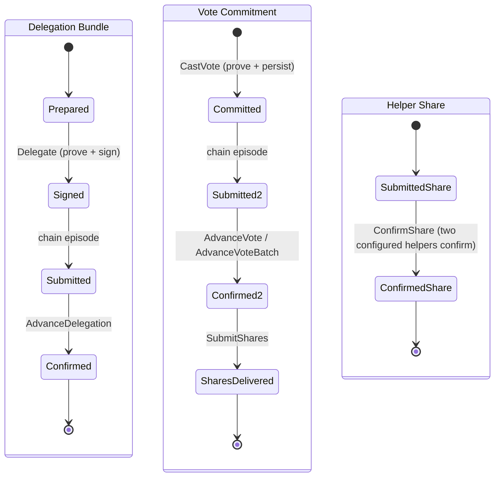

# Vizor Voting Integration (Rust)

This module integrates the [`zcash_voting`](https://github.com/valargroup/zcash_voting)
crate into Vizor. It owns the wallet-side concerns the crate intentionally leaves
to the host app: wallet seed handling, voting hotkey storage, the voting sidecar
database, delegation signing, and the Flutter Rust Bridge (FRB) surface that
exposes the crate lifecycle to Dart.

`zcash_voting` owns the protocol and the durable recovery state machine. Vizor
adds no parallel workflow tables. All phases and recovery are derived from the
crate's own `bundles`, `votes`, and `share_delegations` rows. For the canonical
setup -> precompute -> delegate -> vote -> share lifecycle, the per-bundle phase
definitions, and the restart planner, see the crate docs:

- Crate README: [`zcash_voting/zcash_voting/README.md`](https://github.com/valargroup/zcash_voting/blob/main/zcash_voting/README.md)
- Reference usage: [`wallet-example/src`](https://github.com/valargroup/zcash_voting/tree/main/wallet-example/src)
  (`example_delegation.rs`, `example_vote.rs`, `example_recovery.rs`)

This document focuses on what Vizor's integration is responsible for.

## Module Map

| File | Responsibility |
| --- | --- |
| `db.rs` | Opens the voting sidecar DB via `VotingDb::open_wallet_sidecar` at the deterministic path next to the wallet DB. The crate keeps one connection per sidecar path and owns busy handling; the voting schema is isolated from the wallet `user_version`. |
| `network.rs` | Converts between wallet-layer network enums and `zcash_voting::Network` so wallet modules do not depend on API-layer helpers. |
| `hotkey.rs` | Reconstructs app-owned voting hotkeys from stored opaque secret bytes before handing them to crate operations. The secret is never persisted by Rust. |
| `signer.rs` | The wallet seed boundary. Implements the crate's `SpendAuthSigner` over the account mnemonic: verifies the seed fingerprint, derives and randomizes the SpendAuth key, and returns only the detached signature. |
| `delegation.rs` | Opens the crate's `DelegationPipeline` for an account and round (wallet DB opener, lightwalletd inputs, hotkey, bundle policy) and wraps the stage calls the FRB boundary still exposes: bundle setup, eligibility, snapshot PIR precompute, background proof, Keystone requests, and PIR cache warm-up. |
| `network_clients.rs` | The only construction boundary for voting SDK network clients. Injects one shared routed transport into chain, helper, PIR, pre-sync tree, and the round executor's separate tree slot. |
| `route.rs` | `VizorRoute`, the request executor behind every routed SDK transport. Tor requests go through the wallet's Tor client and fail closed while Tor is selected but unusable; direct requests use the crate's `DirectRoute`. Chain, helper, PIR, and vote-tree traffic use it through `network_clients.rs`. |
| `transport.rs` | Fetches the voting snapshot anchor over the process route policy (`open_lwd_channel` + `anchor_tree_state_with_retry_on`) so delegation inputs never dial lightwalletd directly. This module owns the route decision and *dial* retry; the crate owns the *RPC* retry. |
| `../../api/voting_session.rs` | `VotingRoundSession`, the opaque FRB handle over `zcash_voting::RoundExecutor`. One session binds the sidecar, account, round, proposal roster, routed transports, and hotkey; Dart records ballot intents, reads the plan, and advances steps. |
| `../../api/voting.rs` | The remaining stage-level FRB boundary: hotkey generation, delegation preparation, Keystone signature storage, vote-tree warm-up, share tracking passes, recovery reads, resets, and config resolution. |
| `../../api/voting_helpers.rs` | API-only helper glue for delegation input resolution and bundle-parameter construction used by the FRB boundary. |

## Account Invariants And Secret Boundaries

Coinholder voting uses a crate-owned voting hotkey for delegation outputs and
vote signing.

- Software and hardware accounts both generate a random per-account, per-round
  hotkey through `zcash_voting::hotkey::generate_random_voting_hotkey`. Dart
  stores the opaque hotkey secret bytes and passes them back for later
  delegation and vote work.
- If the stored hotkey is missing after any hotkey-bound artifact exists, the
  session must fail instead of generating replacement material. v2 does not try
  to recover deterministic hotkeys from the wallet seed.
- Locked software wallets still need the mnemonic only for delegation SpendAuth
  signing. Hotkey generation and vote signing do not require mnemonic access.

The wallet seed never leaves the wallet boundary. Delegation signing in
`signer.rs` consumes a crate-provided `DelegationSigningRequest`, verifies the
seed fingerprint, derives the account SpendAuth key, randomizes it with
`alpha`, and returns only the detached signature. The crate never receives
root seed material; the round session hands it a `SpendAuthSigner` callback or
a stored Keystone signature.

### Session Pinning

A `votingSessionProvider(roundId)` instance is pinned to the active account UUID
captured when the session is built. All later context reloads, recovery reads,
delegation setup, vote-tree sync, vote submission, and share recovery must
continue to use that session account, even if the user switches accounts while
the round screen is open. Do not re-read the active account inside individual
session actions except through the session-pinned account helper.

## Durable vs Process-Local State

Two kinds of state exist, and they are both account scoped:

- **Durable** state lives in the `zcash_voting` sidecar tables (delegation
  bundles, signed artifacts, transaction hashes, VAN/VC positions, share
  submission history). This is the recovery source of truth.
- **Process-local** state is Rust memory and cached clients owned by the current
  app process, including the crate-owned vote-tree client.

Any durable key or process-local cache that touches prepared PCZTs, vote-tree
sync state, hotkeys, recovery rows, or share-delegation history must include the
wallet DB path plus the session account UUID where applicable.

Dart shares only the in-flight snapshot/PIR preparation prerequisite between
the review and submission providers. It does not mirror proof state or add a
proof lock. Delegation proof locking, durable persistence, concurrent-caller
coordination, and reuse remain exclusively owned by `zcash_voting`; a
foreground caller may join snapshot readiness but never waits for every
background sibling proof.

### Reset Semantics

`reset_vote_tree(db_path, account_uuid, round_id)` clears only process-local
vote-tree sync state. It does not delete durable recovery rows, signed
artifacts, transaction hashes, or share history, and it does not abort in-flight
proof or vote jobs already running on worker threads.

- A non-empty `round_id` performs round-scoped cleanup via
  `zcash_voting::precompute::reset_vote_tree(db, round_id)`.
- `None` or an empty `round_id` is an account-wide reset via
  `zcash_voting::precompute::reset_vote_tree(db, "")`.

`reset_voting_session_state(db_path, account_uuid, round_id)` is broader. It
clears the same vote-tree sync state and also clears unsigned delegation setup
fields for abandoned round work. Do not use it for best-effort vote-tree warmup
failover while the user may still be signing or submitting.

Vote-tree sync and reset are owned by the crate
(`zcash_voting::precompute::{sync_vote_tree_with, reset_vote_tree}`); Vizor does not
maintain its own tree-sync registry.

Account-wide reset runs when switching away from the active account, removing an
account, resetting the wallet, or locking/signing out. These lifecycle
boundaries invalidate the owner of the process-local tree client but never
delete durable `zcash_voting` recovery rows.

## Lifecycle And Recovery

Casting and delegating run through one SDK round session. Dart opens
`open_voting_round_session` with the account, round, roster, chain endpoints,
PIR endpoints, and (when votes may be cast) the stored hotkey, then drives the
crate's plan:

| Session call (`api/voting_session.rs`) | Crate API |
| --- | --- |
| `plan` | `RoundExecutor::plan` (`session::resume_plan`) |
| `set_ballot_intents` | `RoundExecutor::set_ballot_intents` — writes intent and re-plans under the round lock |
| `run_round` | `RoundDriver::run` — re-plans from durable state, dispatches the steps the plan lists, overlaps independent bundles, isolates a failure to its bundle, and stops with a `RoundQuiescence`. Each step proves and signs delegations through `DelegationPipeline`, casts every planned draft of a bundle (tree sync with node failover, VAN witness, proofs, atomic persistence, helper plans, chain advance to a terminal outcome, share delivery once confirmed), resumes persisted vote work, and confirms shares |
| `keystone_signing_requests` | `DelegationPipeline::keystone_request` |
| `run_share_tracking` | `ShareTrackingDriver::run` — repeats a tracking pass on the delay each pass computes, stops at vote end, and reports why through `ShareTrackingQuiescence` |
| `confirm_immediate_share` | `share_tracking::confirm_pending_share` |

A run streams `RoundDriveEventView` observations and ends with exactly one
`RoundRunReportView`; a tracking run streams `ShareTrackingEventView` and ends
with one `ShareTrackingRunReportView`. Delegation steps lock per bundle; chain
and share steps lock per round. Dart keeps only what the SDK cannot see — app
lock, account and round identity, cancellation, progress projection, the
network route, and secret custody. Failures reach Dart as typed
`VotingErrorView` values and step failure kinds; no phase, kind, or error text
is matched as a string.

Running a single step is not available: the driver carries the operation epoch
it dispatched under into each step, so a session or account switch interrupts
work already in flight instead of being adopted by it. `RoundExecutor::plan`
and `set_ballot_intents` remain the only direct executor calls.

Preparation and recovery reads stay stage-level:

| Stage | FRB entry (`api/voting.rs`) | Crate API |
| --- | --- | --- |
| Background PIR cache warm-up | `warm_pir_proof_cache` | `selection::select_notes_with_lwd`, `precompute::{cache_pir_proofs, prune_pir_proof_cache}` — bundle-, round-, and hotkey-independent; keyed by `(wallet_id, network, root, nullifier)`, read by the delegation prove path |
| Bundle setup / eligibility | `setup_delegation_bundles`, `check_voting_eligibility`, `precompute_snapshot_bundles` | `DelegationPipeline::{setup_bundles, eligibility, precompute_pir}` |
| Background software delegation proof | `precompute_delegation_proof` | `DelegationPipeline::ensure_proof` — persists ZKP1 after snapshot PIR warm-up without receiving the mnemonic or signing |
| Keystone signatures | `build_keystone_delegation_requests`, `store_keystone_signatures_batch`, `get_keystone_signatures`, `delete_skipped_bundles` | `DelegationPipeline::keystone_request`, `VotingDb` Keystone signature rows (`SetupAlreadyPersisted` on conflicting re-signs) |
| Share tracking | `list_pending_share_rounds` (session-scoped runs use `run_share_tracking` above) | `share::pending_rounds_for_accounts` |
| Ballot intent / restart | `set_ballot_intent`, `get_round_plan` | `VotingDb::set_ballot_intent`, `session::resume_plan` |

Restart recovery is driven by `session::resume_plan`, which returns the ordered
remaining `NextStep`s and the proposals still open. Dart consumes the crate's
typed plan enums (`NextStepKind`, `RoundPlanActionKind`, `WorkflowPhaseView`);
it does not derive its own phases.

The round plan is the wallet's whole view of durable round state. Dart keeps no
indexed mirror of delegation, vote, or share rows: bundle counts and delegation
work come from `delegation_statuses`, outstanding share work from
`has_unconfirmed_shares` and `blocking_share_work`, and the next tracking delay
from `share::next_tracking_delay_for_round`. Durable share records never cross
the bridge.



### Keystone proof warmup

Snapshot bundle preparation starts background ZKP1 work for both software and
Keystone accounts. The SDK stores the exact signing transaction alongside the
proof setup, so QR preparation and app restart reuse those bytes and the same
stored voting hotkey. Signing can proceed while the proof runs.

Vizor briefly retries the SDK's `Busy` error when initial setup overlaps QR
preparation. Signing errors preserve warmed setup instead of resetting it. This
path assumes the new voting package is installed before preparing the next
round; it does not repair older setups that lack the original transaction.

### Helper Share Scheduling

Helper-share `submit_at` (the Unix-second reveal time sent to the helper server)
is planned and durably persisted by `zcash_voting`'s complete-batch delivery
API. Vizor supplies authenticated round timing, the configured fleet, and the
round's immediate-share key; the SDK owns entropy, readiness-derived targets,
placement, generation binding, and restart reuse:

- The last-moment buffer is 40% of the round duration from `ceremony_phase_start`
  to `vote_end_time`, capped at six hours.
- Before that buffer, each share samples a randomized `submit_at` uniformly in
  `[now, vote_end_time - buffer)`.
- Inside the buffer, the vote commitment uses single-share mode and shares use
  `submit_at = 0` (immediate submission).
- If round timing is missing or invalid, Vizor uses `submit_at = 0`.

Overdue recovery submits immediately (`submit_at = 0`), while early
under-placement replenishment preserves the original schedule in both the
helper payload and durable record. The canonical scheduling, delivery,
retry, and polling policy lives in the SDK. The round session delivers a
confirmed vote's shares inside the same step that confirmed it; Dart neither
materializes plans nor submits individual helper payloads. The SDK also
enforces the process-wide ceiling of 16 concurrent helper POSTs.

Definite acceptances, outcome-unknown deliveries, and in-flight markers left by
an interrupted process remain tracked after the vote screen closes. An
outcome-unknown helper is polled for global on-chain confirmation but never
counts toward the intended placement target because a `pending` response does
not prove possession. Early replenishment uses other eligible helpers without
waiting for the overdue threshold. Overdue recovery first tries untried
helpers, then may duplicate-safely re-POST an outcome-unknown helper once in
that pass.
Configured helpers are trusted global chain-status oracles, but one helper
cannot finalize a share by itself. The crate requires matching `confirmed`
responses from two distinct helpers in the current configuration and binds the
confirmation write to the exact stored nullifier generation. Vizor uses the
crate's focused `confirm_pending_share` API for the designated immediate share
and `ShareTrackingDriver` for background recovery. It does not expose helper
observations, schedule passes, or implement a second polling path.

Fresh commitments use a strict, SDK-persisted complete plan. The SDK reuses
that exact plan after restart and submits only definite-delivery deficits, so
fleet compatibility, aggregate quota, and target guarantees remain bound to
the original commitment generation. The Rust boundary separates preparation
after durable vote commitment creation from submission after confirmation
persistence, so the host cannot conflate those lifecycle steps. Normal vote
confirmation advances a matching plan from the exact pre-confirmation recovery
snapshot to the exact confirmed snapshot; replacement, clearing, and unrelated
recovery-material changes invalidate it. `LegacyBestEffort` is metadata only
for old durable state that predates complete-plan persistence. Vizor surfaces
that state but does not implement a second replanning policy.

Initial submission and recovery share one account/round/database-bound Rust
helper delivery context. Before a fresh helper POST, the crate commits an
in-flight (`attempting`) marker; it then promotes that marker to definite
acceptance or outcome-unknown, or removes it after a definite pre-dispatch
failure. A crash or failed outcome write therefore leaves the helper poll-only
during early replenishment. Once overdue, duplicate-safe recovery can retry it
after untried helpers without mistaking it for a fresh target.
Tor connection, TLS, connect-timeout, URL, and request-construction failures
are definite and remain retryable; request/response-phase failures are
ambiguous.

On launch, unlock, and resume, Vizor asks
`zcash_voting::share::pending_rounds` for durable
unconfirmed rounds and rejects malformed or unauthenticated entries before
restoring a session. The persisted session deadline is only a discovery hint:
because a server may extend an existing round after that immutable metadata was
stored, the restored session verifies live round status before deciding whether
recovery remains open. A restored session checks only helpers still present in
the current config and retains itself while work remains. Overdue shares use
the crate's randomized, health-aware recovery order and continue until the
complete definite-placement deficit is filled, candidates are exhausted, or
the round cutoff is reached. An outcome-unknown POST remains eligible for
status polling, and recovery may continue to another helper when a transport
outcome is ambiguous. This deliberately trades possible duplicate encrypted-
share delivery and additional helper metadata exposure for liveness when a
share might otherwise never reach the chain. Lock, account
deletion, and wallet reset stop and drain discovery plus active checks before
protected state changes. If a mutation aborts while wallet state remains,
Vizor requests fresh discovery after leaving the mutation boundary.

## Wire Types And FRB Scanning

`zcash_voting::wire` is the canonical owner of protocol wire JSON and wallet view
DTOs (field names, `serde` renames, base64/hex shaping, JSON-safe integer
bounds), for example `DelegationSubmissionWire`, `VoteCommitmentWire`,
`VanWitness`, `RoundPlanView`, `RoundStepOutcomeView`, and `VotingErrorView`. See
`zcash_voting::wire` for the full set.

Vizor keeps no FRB-local `Api*Wire` mirrors for these types. FRB codegen scans
the shared crate module directly via `flutter_rust_bridge.yaml`:

```yaml
rust_input: crate::api,zcash_voting::wire
```

That scan emits Dart value classes under
`lib/src/rust/third_party/zcash_voting/wire.dart` and generates the
`SseEncode` / `SseDecode` glue in Vizor's bridge code. The `zcash_voting` crate
stays framework-agnostic and does not depend on FRB.

FRB third-party scanning expects a struct-only module surface, so the DTO structs
stay in `zcash_voting::wire` while serialization helpers and conversions that
pull richer crate internals (`VotingError`, payload transforms) live in
`zcash_voting::wire_codec`. Call sites import canonical structs from
`zcash_voting::wire::*`.

## Network route invariants

All foreground voting traffic follows the selected wallet route. SDK default
clients connect directly: `RoundExecutor::with_transport` configures only the
chain, not the tree. Construct network clients through `network_clients.rs`;
never call SDK default constructors or the unconfigured tree-sync convenience
function at a service call site. Pre-sync and executor tree sync use the same
process-wide transport Arc because the SDK keys incremental tree clients by
transport identity. Resolve the route per request, including after settings
changes; an unavailable selected Tor route must never fall back to direct.

| Entry | Construction / transport |
| --- | --- |
| Discovery, config, round status, participation | Dart `NetworkHttpClient` |
| Snapshot anchor | `transport::fetch_snapshot_tree_state`, routed lightwalletd |
| PIR endpoint resolution | `network_clients::routed_transport` |
| PIR warm-up and delegation proofs | `network_clients::pir_fleet` |
| Chain submission | `network_clients::round_executor` |
| Helper preflight, delivery, confirmation | `network_clients::helper_client` |
| Tree pre-sync | `network_clients::sync_vote_tree` |
| Tree sync during cast | Executor built with `with_tree_transport` in the factory |

`cargo test --lib` includes real socket-blocking tests for the service wiring,
a route-switch/cache test, and `sdk_network_construction_stays_in_the_factory`.
The source guard is supplemental (not a Rust semantic analyzer); aliases or
future SDK APIs still require review. SDK upgrades must audit newly introduced
network roles and add them to this table and the service tests.

The app-wide intentional exceptions are iOS background migration's pinned
transport and links opened by external apps. Neither grants foreground voting
an exception. Local update proxies forward remote downloads through Tor.
